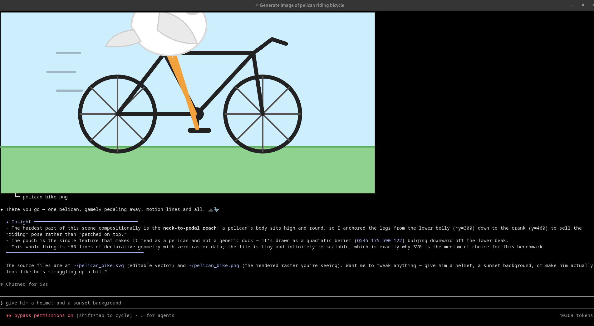

# claude-kitty-image

[](https://github.com/whallil/claude-kitty-image/actions/workflows/validate.yml) [](LICENSE)

Show real PNG/JPEG images **inline** in a [Claude Code](https://claude.com/claude-code) session running inside the [Kitty](https://sw.kovidgoyal.net/kitty/) terminal — charts, diagrams, screenshots, rendered output — without them overlapping the text Claude prints afterward.



It ships as a Claude Code **plugin** containing a single skill, `kitty-image`, that Claude invokes automatically whenever you ask for a chart, plot, diagram, or any visual that block-character ASCII can't do justice.

## The problem it solves

Claude Code's Bash tool runs with no controlling TTY, so the normal `kitty +kitten icat` fails:

```
OSError: No such device or address: '/dev/tty'
```

This plugin walks the process tree to find your `claude` process, reads its real PTY, and writes [Kitty graphics protocol](https://sw.kovidgoyal.net/kitty/graphics-protocol/) escape sequences straight to it. Kitty renders the image on its own graphics layer.

The harder problem is **layout**: that graphics layer is invisible to Claude's text renderer, so by default Claude packs its next message right on top of the image. This plugin fixes that by measuring the image's height in terminal rows (from the PNG header + the PTY's pixel geometry) and reserving that many real rows through the tool's stdout — the one channel Claude commits to its screen model — so following text lands cleanly below the image.

## Requirements

- **Kitty terminal** (`TERM=xterm-kitty`). The skill refuses to run elsewhere. Other Kitty-protocol terminals (Ghostty, WezTerm, Konsole, iTerm2) may work with a manual `--pts` override, but are untested.
- **Python 3** (standard library only). [Pillow](https://python-pillow.org/) is optional — needed only to transcode non-PNG input (e.g. JPEG) to PNG.
- Linux. PTY discovery reads `/proc`, so macOS is not currently supported.

## Install

In Claude Code:

```
/plugin marketplace add whallil/claude-kitty-image
/plugin install kitty-image@thistle-intelligence
```

That's it. Ask Claude for a chart or diagram and it will render inline.

## Usage

Normally you don't call anything — Claude invokes the skill on its own. To drive the script directly:

```bash
# Display an image
python3 "${CLAUDE_PLUGIN_ROOT}/skills/kitty-image/show.py" /path/to/image.png

# Target a specific PTY if auto-detect picks the wrong one
python3 "${CLAUDE_PLUGIN_ROOT}/skills/kitty-image/show.py" /path/to/image.png --pts /dev/pts/4

# Clear all images on the active PTY
python3 "${CLAUDE_PLUGIN_ROOT}/skills/kitty-image/show.py" --clear
```

## Known limitations

- **Drift margin is a heuristic.** Space reservation adds a small fixed margin to absorb the offset between where the image anchors and where the reserved rows land. For the skill's normal one-line invocation this is stable; a pathologically long, wrapping command could still clip a row or two.
- **Images taller than the screen** overflow, since reservation is capped at the terminal height. Fit-to-screen downscaling isn't implemented yet.
- **Persistence.** Images stay until Kitty scrolls them out of view, you clear the screen, or you run `--clear`. Claude's redraws don't remove them.

## License

Free for **noncommercial** use under the [PolyForm Noncommercial License 1.0.0](./LICENSE) — personal projects, education, research, and use by nonprofit or government organizations.

**Commercial or enterprise use requires a separate license** from Thistle Intelligence, LLC. Contact **licensing@thistleintelligence.com**.
